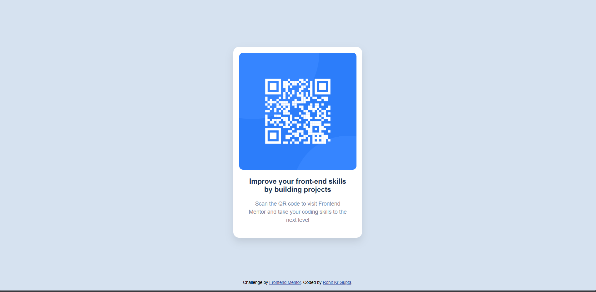

# Frontend Mentor - QR code component solution

This is a solution to the [QR code component challenge on Frontend Mentor](https://www.frontendmentor.io/challenges/qr-code-component-iux_sIO_H). Frontend Mentor challenges help you improve your coding skills by building realistic projects. 

## Table of contents

- [Overview](#overview)
  - [Screenshot](#screenshot)
  - [Links](#links)
- [My process](#my-process)
  - [Built with](#built-with)
  - [What I learned](#what-i-learned)
  - [Continued development](#continued-development)
- [Author](#author)

**Note: Delete this note and update the table of contents based on what sections you keep.**

## Overview

### Screenshot



### Links

- Solution URL: [Add solution URL here](https://your-solution-url.com)
- Live Site URL: [Add live site URL here](https://your-live-site-url.com)

## My process

### Built with

- Semantic HTML5 markup
- CSS custom properties
- Flexbox
- CSS Grid
- Mobile-first workflow

### What I learned

The most important thing I learn from this challenge is working with css with giving proper classes to each div and using that css properties that can lead to make layout mobile responsive too without giving extra effort.  

Adding rel-noopener and norefferer can make site more secure

```html
<div class="attribution">
      Challenge by <a href="https://www.frontendmentor.io?ref=challenge" target="_blank" rel="noopener noreferrer">Frontend Mentor</a>. 
      Coded by <a href="https://github.com/Rohitkrgupta8292" target="_blank" rel="noopener noreferrer">Rohit Kr Gupta</a>.
    </div>
```
```css
 .container {
      background-color: hsl(0, 0%, 100%);
      border-radius: 15px;
      box-shadow: 0 10px 20px rgba(0, 0, 0, 0.1);
      overflow: hidden;
      width: 300px;
      padding: 15px;
      margin-top: 120px;
    }
```

### Continued development

In Future I want to build some more real world project that can help people solve real world problems. I want to implenent more responsive and modern tech such as tailwindcss, react, jquery, bootstrap etc

## Author

- Website - [Rohit Kr Gupta](https://github.com/Rohitkrgupta8292)
- Frontend Mentor - [@Rohitkrgupta8292](https://www.frontendmentor.io/profile/Rohitkrgupta8292)

